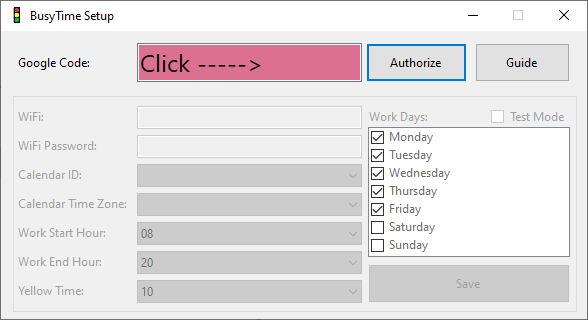
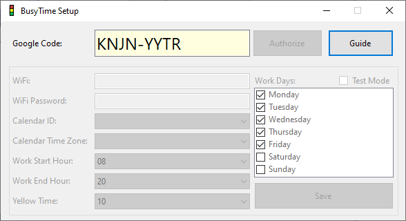
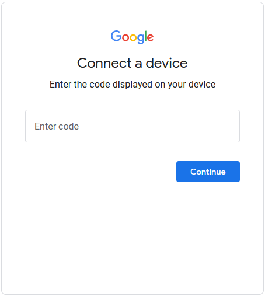
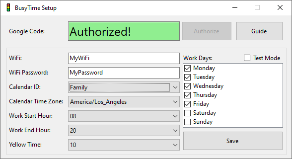

# BusyTime Setup Guide

## Authorize google to access you calendar
1. The **Google Code** will be Red to indicate that you need to authorize google permissions in order to continue.  

1. Click **Authorize**
1. The **Google Code** wwill turn Yellow while it waits for you to complete the authorization.  

1. Setup will generate a code and place it in **Google Code** and copy it into the clipboard.
1. A browser will start up seeking permissions to your google account.
1. Paste the code into the form brought up in the web browser.  

1. Click through dialogs to give permissions.
1. Once permission is granted successfully return to setup
1. The **Google Code** section will turn green indicating success.  

## Configure BusyTime
* **WiFi:** WiFi name to connect to.
* **WiFi Password:** WiFi password to use.
* **Calendar ID:** Name/ID of the google calendar to use for showing BusyTime.
* **Work Start Hour:** Hour to start reporting BusyTime (24hour).
* **Work End Hour:** Hour to stop reporting BusyTime (24hour).
* **Yellow Time:** Number of minutes to show Yellow light before a BusyTime.
* **Work Days:** Days of the week to check for BusyTime.
* **Brightness:** Brightness of the light, on a scale of 0-100